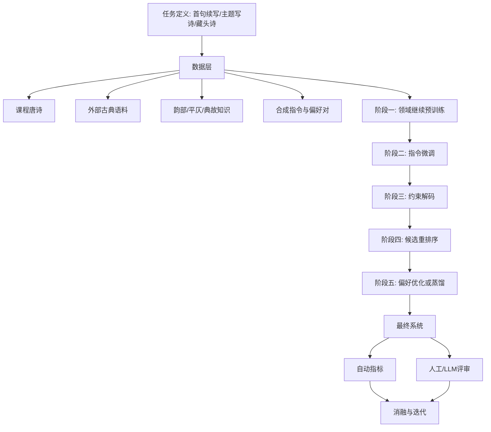
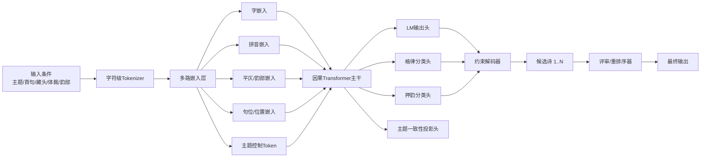
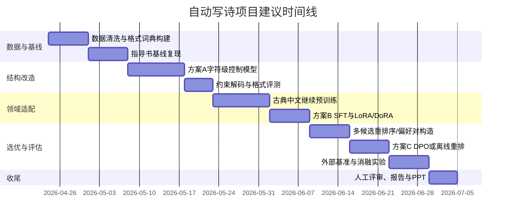

# 自动写诗任务的前沿深度学习方案研究报告

## 执行摘要

这份报告以“自动写诗”实验为直接落点，同时按你的要求把研究范围扩展到近三年内、可迁移到计算机视觉、自然语言处理、语音与多模态系统中的通用“提效”方法。结合指导书约束，本任务的核心不是“把一个更大的模型直接套上去”，而是要在**网络结构设计、领域适配、结构控制、训练范式与评估闭环**上一起做改造：指导书明确要求用 Python 与任意深度学习框架完成自动写诗程序，允许首句续写，且网络结构不能与指导书中的 Embedding+LSTM+全连接基线完全相同；实验提供了约 57,580 首唐诗数据，亦可使用其他唐诗数据集。fileciteturn0file0

近三年与本任务最相关的高置信度结论有四条。其一，**面向古典诗歌的“字符级/字级生成 + 显式格式约束”仍然是最有效的格式控制路线**；CharPoet 直接指出 token-free、逐字生成更容易精确控制字数与诗体格式，且其格式准确率显著优于若干通用生成系统。其二，**领域继续预训练与古典中文专门表征很关键**；PoemBERT 证明了在古诗语料上进行专门预训练，并把情感、拼音、动态 masking 等诗歌特征纳入模型，可以显著提升下游生成与理解表现。其三，**古典中文/诗歌不是“普通中文”的简单子集**；TongGu、WenyanGPT、WenMind、Fùxì 等工作与基准共同表明，通用 LLM 在古典中文理解与生成上存在明显短板，单纯提示工程不足以补齐领域鸿沟。其四，**从工程可落地性看，QLoRA/DoRA/PEFT + 继续预训练 + 约束解码 + 偏好优化/重排序**，是当前投入产出比最高的一条组合路径。citeturn32search1turn17view0turn25search6turn29search10turn25search13turn29search6turn23search2turn24search18turn28search0turn28search5

因此，本报告给出的**默认推荐方案**不是继续沿用单层 LSTM，而是采用一个“**字符级控制型诗歌解码器**”：输入端融合字嵌入、拼音嵌入、平仄/韵部嵌入、句位嵌入和主题控制 token；主干采用小到中等规模的因果 Transformer；训练上采用“古典中文继续预训练 → 指令化微调 → 规则约束解码 → 候选重排序/偏好优化”的四阶段流程；部署上根据资源预算分别走从零训练小模型、Qwen2.5 类基座模型的 LoRA/QLoRA 微调、以及生成器+评审器双模型三条路线。这个建议同时吸收了跨领域近三年的共性经验：视觉中的 DINOv2 强调高质量预训练数据与蒸馏，LLaVA-1.5 强调数据效率与指令微调，SeamlessM4T 强调自监督跨模态预训练，Qwen2.5-Omni 则说明了统一多模态架构与时间对齐设计的重要性。它们虽然不直接解决写诗，但都支持一个共同判断：**效果提升的主导项往往不是单点结构创新，而是“高质量数据 + 领域适配 + 轻量高效后训练 + 更严格评估”的系统设计**。citeturn20search3turn22search3turn26search3turn27search0turn27search7

本报告中所有涉及**诗体选择、是否可用外部预训练模型、是否允许外部语料、课程评分更偏“格律”还是“意境”、以及可用 GPU 预算**的内容，都属于【需按具体任务调整】项；我在后文每个总体设计中都明确标出了这些调整点。fileciteturn0file0

## 任务边界与指导书映射

指导书的约束实际上已经决定了这份研究报告应该**优先聚焦中文古典诗歌生成**，并将 CV/NLP/语音/多模态中的“提效方法”当作可迁移设计原则，而不是把四个领域平均铺开。原因很直接：实验要求是自动写诗、支持首句续写，且不能照搬指导书基线；这使得“网络结构如何体现自定义设计”和“如何在小中等算力下显著优于 LSTM 基线”成为主问题。fileciteturn0file0

| 指导书约束 | 对研究与实现的含义 | 本报告对应决策 |
|---|---|---|
| Python + 任意深度学习框架 | 工程实现不受限于单一框架，但需可复现 | 默认建议基于 entity["organization","PyTorch","deep learning framework"] 与 entity["organization","Hugging Face","ml platform"] 生态，便于 PEFT、DPO、评测和部署整合。fileciteturn0file0 citeturn37view0turn35view0 |
| 网络结构不能与指导书 Embedding+LSTM+FC 完全相同 | 必须提出自己的网络设计 | 主推“字符级控制型 Transformer + 多路嵌入 + 约束解码 + 重排序器”。fileciteturn0file0 citeturn32search1turn17view0 |
| 输入首句续写，可选藏头诗 | 任务本质是条件生成，不只是语言建模 | 训练数据建议构造成“首句/主题 → 全诗”的指令对，并加入藏头、体裁、韵部控制 token。fileciteturn0file0 citeturn32search2turn32search5 |
| 提供约 57,580 首唐诗，也可用其他唐诗数据 | 课程数据足够做基线，但不足以支撑高质量大模型后训练 | 推荐在允许范围内加入 chinese-poetry、CCPM、Fùxì、WenMind 等公开语料/基准作补充。fileciteturn0file0 citeturn10search1turn31search0turn30view0turn25search13 |

如果只允许使用课程数据且只能在单卡上完成，那么最合理的目标不是“追求最强语义能力”，而是**在结构控制、格式正确率、押韵一致率、主题相关性**上稳定超过基线。如果允许使用外部预训练模型，则应把目标升级为：**用轻量后训练把现代中文大模型“拉回”古典中文域，并用规则与偏好学习把创作风格“压实”**。这也是后文三套总体方案的分水岭。fileciteturn0file0 citeturn25search6turn29search10turn28search5

## 近三年核心论文与开源项目

这部分分成三类：第一类是**与自动写诗直接相关**的论文；第二类是**可直接迁移到本任务的通用后训练/领域适配方法**；第三类是**跨视觉、语音、多模态的可迁移“提效原则”**。这样做的目的是把“跟课程作业直接相关的工作”和“可借鉴但不应喧宾夺主的跨领域方法”区分开来。citeturn32search1turn17view0turn25search6turn29search10turn23search2turn24search18turn20search3turn26search3

### 与自动写诗直接相关的代表性论文与基准

| 题目 | 作者 | 会议/期刊 | 年份 | 核心贡献 | 适用场景 | 关键实现要点 | 链接 |
|---|---|---:|---:|---|---|---|---|
| CharPoet: A Chinese Classical Poetry Generation System Based on Token-free LLM | Chengyue Yu 等 | ACL Demo | 2024 | 用 token-free、逐字生成实现内容与格式双控制，报告格式准确率高于 0.96 | 诗歌生成、首句续写、格式严格任务 | 逐字生成；显式控制字数/句式；适合把“格律规则”移到解码侧 | 论文/系统 citeturn32search1turn32search0turn32search13 |
| PoemBERT: A Dynamic Masking Content and Ratio Based Semantic Language Model For Chinese Poem Generation | Chihan Huang 等 | COLING | 2025 | 针对古诗建立专门预训练模型，引入情感与拼音嵌入、CI-mask 与动态 masking | 古诗生成、古诗分类/理解 | 预训练 + 情感模型 + PMI 统计 + 动态 masking rate；仓库给出训练脚本 | 论文/代码 citeturn17view0 |
| TongGu: Mastering Classical Chinese Understanding with Knowledge-Grounded Large Language Models | Jiahuan Cao 等 | Findings of EMNLP | 2024 | 提出知识增强古典中文 LLM，强调知识密集型与数据密集型任务上的领域差距 | 古典中文理解、可作为诗歌生成底座的领域适配参考 | 领域知识接入、专门指令数据、古典中文任务集评测 | 论文/项目 citeturn25search2turn25search6turn25search14 |
| A Large Language Model for Classical Chinese Tasks | Xiaoyu Yao 等 | IJCAI | 2025 | 提出 WenyanGPT 与 WenyanBENCH，面向古典中文任务做预训练和指令微调 | 古文/诗歌/对联等经典文本任务 | 领域语料继续预训练 + 任务化指令数据构造 | 论文 citeturn29search10 |
| WenMind: A Comprehensive Benchmark for Evaluating Large Language Models in Chinese Classical Literature and Language Arts | Jiahuan Cao 等 | NeurIPS Datasets and Benchmarks | 2024 | 系统覆盖古文、古诗、古典文化多子领域，说明通用 LLM 在 CCLLA 上仍有明显盲区 | 评测、误差分析、模型选型 | 适合作为古诗生成系统的“外部验证集”与能力边界检查 | 论文/基准 citeturn25search13turn38view7 |
| Fùxì: A Benchmark for Evaluating Language Models on Ancient Chinese Text Understanding and Generation | Zhao 等 | arXiv | 2025 | 同时覆盖理解与生成 21 个任务，含诗歌生成、对联、词生成等，并结合规则验证与 LLM 评审 | 诗歌生成综合评测 | 特别适合做“格式+语义+文化”三维评估 | 论文/代码 citeturn29search6turn30view0 |
| Benchmarking LLMs for Translating Classical Chinese Poetry: Evaluating Adequacy, Fluency, and Elegance | Andong Chen 等 | EMNLP | 2025 | 强调古典诗歌任务不能只看 adequacy，还要看 fluency 与 elegance | 若你的任务含诗歌解释、翻译或双语展示 | 人工评价维度可直接借来做写诗评分 rubric | 论文 citeturn8search3turn29search18 |
| Human-in-Loop Classical Chinese Poetry Generation System | Jing Ma 等 | EACL Demo | 2023 | 提出“生成 + 人工润色/交互打磨”双阶段管线 | 课程展示、交互系统、创作辅助 | 支持自动生成与 polishing；对“评审器/重写器”设计很有启发 | 论文/系统 citeturn32search2turn32search5 |
| CCPM: A Chinese Classical Poetry Matching Dataset | Wenhao Li 等 | arXiv | 2021 | 从“诗句匹配”切入语义理解，为古诗语义评估提供稳健补充 | 生成模型的语义理解外部测试 | 可用来做“生成前后语义保持”与编码器质量验证 | 论文/代码 citeturn31search0turn31search7 |

### 可直接迁移到本任务的通用方法论文

| 题目 | 作者 | 会议/期刊 | 年份 | 核心贡献 | 适用场景 | 关键实现要点 | 链接 |
|---|---|---:|---:|---|---|---|---|
| QLoRA: Efficient Finetuning of Quantized LLMs | Tim Dettmers 等 | NeurIPS | 2023 | 4-bit 量化基座 + LoRA，显著降低显存开销；论文指出可在单张 48GB GPU 上微调 65B 模型 | 中低预算后训练 | NF4/4-bit、LoRA adapter、bitsandbytes | 论文/代码 citeturn23search2turn38view1 |
| Direct Preference Optimization: Your Language Model is Secretly a Reward Model | Rafael Rafailov 等 | NeurIPS | 2023 | 用偏好对直接优化策略，避免显式 reward model + PPO 的复杂流水线 | “优雅/意境/押韵更好”这类相对偏好优化 | 需要 chosen/rejected 偏好对；β 是关键超参 | 论文/代码 citeturn24search18turn24search6turn38view3 |
| DoRA: Weight-Decomposed Low-Rank Adaptation | Shih-Yang Liu 等 | ICML | 2024 | 把权重分解为 magnitude 与 direction，缩小 LoRA 与全参微调的效果差距 | 在相同预算下追求更强微调效果 | 往往可直接替换 LoRA；对训练稳定性更友好 | 论文/代码 citeturn28search0turn28search6 |
| Efficient Continual Pre-training for Building Domain Specific Large Language Models | Xie 等 | Findings of ACL | 2024 | 证明继续预训练是构建领域 LLM 的有效替代路线，但需关注遗忘与效率 | 把现代中文模型迁移到古典中文/诗歌域 | 混合通用语料回放、控制学习率、持续预训练长度 | 论文 citeturn28search5 |
| DistiLLM: Towards Streamlined Distillation for Large Language Models | Jongwoo Ko 等 | ICML | 2024 | 面向 LLM 的更流畅蒸馏流程，兼顾压缩与性能保留 | 课程验收、线上部署、小模型复现 | 教师-学生蒸馏；适合把方案 B/C 压缩到小模型 | 论文/代码 citeturn18search11turn19search1 |

### 跨视觉、语音、多模态的可迁移提效代表作

| 题目 | 领域 | 年份 | 对本任务的启发 | 链接 |
|---|---|---:|---|---|
| DINOv2: Learning Robust Visual Features without Supervision | 计算机视觉 | 2023 | 高质量数据构建、自监督预训练、大模型蒸馏到小模型，说明“数据质量 + 蒸馏”通常比单纯堆参数更稳 | 论文/代码 citeturn20search3turn19search3 |
| Improved Baselines with Visual Instruction Tuning | 多模态 | 2024 | LLaVA-1.5 用较简单的连接器与约 120 万公开数据实现高效训练，说明**结构未必复杂，数据与训练配方更关键** | 论文/代码 citeturn22search2turn22search3turn22search6 |
| SeamlessM4T: Massively Multilingual & Multimodal Machine Translation | 语音/多模态 | 2023 | 自监督预训练 + 多模态统一建模可明显拓展能力边界；若未来扩展“朗诵诗/配音/图生诗”，这条路线很有参考价值 | 论文/代码 citeturn26search3turn26search7 |
| Qwen2.5-Omni Technical Report | 多模态 | 2025 | Thinker-Talker 与 TMRoPE 说明统一多模态系统的关键是**输入时间/位置对齐 + 模块职责解耦**；对“图像/音频条件写诗”扩展最有价值 | 论文/代码 citeturn27search0turn27search1turn27search14 |

### 综述与方法论优先阅读清单

| 题目 | 作用 | 链接 |
|---|---|---|
| Instruction Tuning for Large Language Models: A Survey | 梳理 SFT/指令数据构造，对“首句/主题 → 全诗”数据改写最有帮助 | 综述 citeturn9search12 |
| A Survey on Parameter-Efficient Fine-Tuning for Foundation Models | 理解 LoRA/DoRA/Adapter 系谱，便于选择低/中/高资源方案 | 综述 citeturn7search8turn7search16 |
| Why is constrained neural language generation particularly interesting from a planning perspective? | 约束生成综述，对格律、句长、押韵控制非常关键 | 综述 citeturn39search7 |
| A Survey on LLM-as-a-Judge | 建立自动评审器时的偏差、稳定性与校准问题 | 综述 citeturn8search8turn8search4 |

### 开源实现与代码库对比

| 仓库/项目 | 语言/框架 | 主要依赖 | 复现难度 | 代表性结果/能力 | 许可 | 活跃度 | 推荐理由 | 链接 |
|---|---|---|---|---|---|---|---|---|
| chinese-poetry | JavaScript + Python | JSON 语料为主 | 低 | 收录约 5.5 万唐诗、26 万宋诗、2.1 万宋词，适合作为主语料仓 | MIT | 很高，约 51.3k stars | **首选语料入口**；清洗成本低，和课程数据天然兼容 | 仓库 citeturn10search1turn16view5turn34view4 |
| PoemBERT | Python | README 给出训练脚本；需自装训练环境 | 中 | 官方声称在诗歌生成与情感分类上达到 SOTA；给出从情感增强到主模型训练的完整脚本 | 仓库未见显式许可说明 | 低，约 2 stars | **最值得复现的任务专用模型**；能直接借鉴拼音/情感/动态 masking | 仓库 citeturn17view0turn16view2turn34view5 |
| FuxiBench | Python + Shell | `evaluate.py`、few-shot/zero-shot 脚本 | 低 | 覆盖诗歌生成、对联、词生成等 21 任务，并附零样本结果表 | 仓库页未显式列出许可 | 低，约 2 stars | **最适合做外部评测**；可以直接当项目验收脚本 | 仓库 citeturn30view0turn34view6 |
| PEFT | Python | Transformers、Accelerate、Diffusers | 低 | 官方示例中，对 Qwen2.5-3B 仅训练约 0.1193% 参数即可完成 LoRA 适配 | Apache-2.0 | 很高，约 21k stars | **默认必用**；是 LoRA/DoRA/Adapter 的主入口 | 仓库/文档 citeturn37view0 |
| TRL | Python | Transformers、Accelerate、PEFT、DeepSpeed | 中 | 支持 SFT、GRPO、DPO、RewardTrainer，并可从单卡扩到多机 | Apache-2.0 | 很高，约 18.1k stars；2026-04 仍有新版本 | **做 DPO/GRPO 的首选**；和 Hugging Face 生态结合最顺 | 仓库 citeturn35view0turn13view1turn34view1 |
| LLaMA-Factory | Python | Python 3.11、PyTorch 2.6、FlashAttention 2.7、bitsandbytes | 低到中 | 支持 100+ LLM/VLM，提供零代码 CLI/WebUI；ACL 2024 系统演示 | Apache-2.0 | 极高，约 70.5k stars | **最适合课程与中小课题**；上手快、配置完整、支持 QLoRA/DPO | 仓库 citeturn12view0turn36view0turn34view0 |
| OpenRLHF | Python | Ray + vLLM + DeepSpeed | 中到高 | 覆盖 PPO、REINFORCE++、GRPO、RLOO，并支持自定义奖励与多轮代理式 RLHF | Apache-2.0 | 高，约 9.4k stars | **高资源方案首选**；当你需要奖励函数/在线采样时优于纯 TRL | 仓库 citeturn16view1turn35view2turn34view3 |
| OpenCompass | Python | Python CLI；可接 vLLM / LMDeploy | 低 | 支持 100+ 数据集，适合统一离线评测与横向对比 | Apache-2.0 | 中高，约 6.9k stars | **标准化评测最方便**；适合做课程答辩前的统一表格输出 | 仓库 citeturn15view0turn35view5turn34view2 |
| vLLM | Python 为主的推理引擎 | PagedAttention、连续批处理、量化支持 | 中 | PagedAttention 论文报告在同等延迟下吞吐可比既有系统提升 2–4 倍 | Apache-2.0 | 极高，约 77.8k stars | **部署/批量生成候选诗必备**；做重排序与多候选采样时非常省钱 | 论文/仓库 citeturn21search0turn35view4turn13view5 |

## 可提升效果的前沿方法与技术路径

从近三年证据看，自动写诗若想明显超过传统 LSTM 基线，最有效的路线不是“换一个更大的 backbone 就结束”，而是要把**数据、领域、控制、偏好、评估**串成闭环。CharPoet 证明了字符级与格式控制的重要性；PoemBERT 证明了古诗专门表征的价值；TongGu/WenyanGPT 说明古典中文需要领域适配；QLoRA/DoRA/PEFT 降低了微调门槛；DPO 与蒸馏则决定了系统是否能从“能写”走向“写得更像样、还能部署”。citeturn32search1turn17view0turn25search6turn29search10turn23search2turn24search18turn28search0turn18search11



上图不是单一论文的复刻，而是将近三年最有效的技术路径抽象成一个可执行工程流程：**先让模型“懂古典中文”，再让模型“按要求写”，最后让系统“筛出更好的诗”。**这点对课程项目尤其重要，因为课程数据规模有限，只做 end-to-end 监督学习通常会把格式学会，却很难把“意境、主题一致性、可读性”一起拉高。citeturn28search5turn32search1turn17view0turn24search18turn18search11

| 方法类别 | 原理 | 优点 | 局限 | 适用条件 | 关键超参/经验初值 | 实现注意事项 | 主要证据 |
|---|---|---|---|---|---|---|---|
| 领域继续预训练 CPT | 在古典中文/诗歌语料上继续做语言建模 | 最能补齐古典中文语感与词汇分布 | 容易遗忘现代中文能力；训练时间增加 | 允许使用预训练基座；有额外古典语料 | lr 1e-5～5e-5；通用语料回放 10%～20%；1～3 epoch 起步 | 先清洗异体字、标点；监控困惑度与“现代口语化漂移” | citeturn28search5turn25search6turn29search10 |
| PEFT 微调 | 只训练少量附加参数 | 显存小、上手快、适合课程与中预算 | 低秩容量有限，风格极端任务可能不够 | 7B 以内尤其合适 | LoRA r=8/16/32；alpha=16/32/64；dropout=0.05～0.1 | 诗歌任务优先给 attention/FFN 都挂 adapter；小数据更建议 DoRA | citeturn23search2turn28search0turn37view0 |
| 字符级生成与约束解码 | 逐字生成，并在标点、句长、韵位上做有限状态控制 | 对五言/七言、绝句/律诗最有效 | 需要自己实现规则和字级 tokenizer | 课程作业、格式严格任务 | 温度 0.7～0.9；top-p 0.8～0.95；束宽 4～8 | 押韵位只在同韵部候选中采样；句末标点固定化 | citeturn32search1turn39search7 |
| 诗歌专门表征 | 增加拼音、情感、平仄、句位等嵌入或辅助头 | 对押韵、情感与风格更敏感 | 需要额外词典与标注/伪标注 | 诗歌、对联、词牌生成 | 嵌入维度 16～64；辅助损失权重 0.05～0.3 | 建议先加拼音与句位，再加情感；不要一次堆太多头 | citeturn17view0 |
| 合成数据与指令化训练 | 把“主题/首句/风格要求 → 全诗”构造成指令对 | 能把生成接口从“续写器”变成“可控创作器” | 合成数据噪声大会伤模型 | 没有人工指令数据时必用 | 合成数据占比先从 20%～40% 起 | 先用模板高精度构造，再让强模型补写说明文字 | citeturn9search12turn33search1 |
| 偏好优化与重排序 | 用 chosen/rejected 或奖励模型优化“更美/更顺/更合规”的相对偏好 | 最能提升“主观质量” | 需要偏好数据；评测与训练可能有偏差 | 有老师/强模型能提供优劣偏好时 | DPO β 常从 0.05～0.3 扫起；候选数 4/8/16 | 偏好标准必须分维度：格律、主题、意象、流畅、创新 | citeturn24search18turn8search8turn8search2 |
| 蒸馏与小模型部署 | 用教师模型训练学生模型 | 便于课程展示和低成本部署 | 如果教师本身风格漂移，学生会继承问题 | 方案 B/C 验证完成后 | 温度 1～2；可配合离线候选蒸馏 | 建议先蒸馏“重排序器”，再蒸馏“生成器” | citeturn18search11turn19search1 |
| 外部理解/评审基准接入 | 用 WenMind、Fùxì、CCPM 等外部集合评估 | 防止模型只在课程测试上“自嗨” | 指标与课程评分不完全同构 | 希望答辩更扎实 | 每轮大改后固定跑一次外部基准 | 至少保留一套“理解型”与一套“生成型”外测 | citeturn25search13turn29search6turn31search0 |

对你这个任务，真正需要优先采用的不是全部八类，而是前三类加“偏好优化/重排序”。换句话说，**默认优先级应是：领域适配 > 字符级控制 > 专门嵌入/辅助损失 > 偏好学习 > 蒸馏部署**；而自动搜索、复杂强化学习、跨模态统一建模则更适合作为后续拓展，而不是课程作业的一开始。这个排序既能最大化效果，也更符合复现风险与资源约束。citeturn32search1turn17view0turn28search5turn24search18

## 建议网络结构设计与可follow总体方案

### 推荐默认网络结构

如果要在“不能与指导书基线相同”的前提下，给出一个**既有明确创新点、又能在课程/研究项目里复现**的网络结构，我最推荐下面这套：**Poetry-Controlled Character Decoder**。它的核心思想是把 CharPoet 的字符级控制、PoemBERT 的诗歌专门表征、TongGu/WenyanGPT 的领域适配思路，以及 QLoRA/DoRA 的低成本后训练能力合并到一条统一路线里。citeturn32search1turn17view0turn25search6turn29search10turn23search2turn28search0



这个结构的关键点有六个。第一，**字符级 tokenization**：古诗的强约束在“字”而不在 subword，逐字生成天然更适合精确控制字数、分句和句末押韵。第二，**多路嵌入**：在字嵌入之外，把拼音、平仄/韵部、句位、体裁与主题控制 token 全部显式化，这一点直接借鉴了 PoemBERT 对拼音/情感等诗歌特征的注入思想。第三，**主干从 LSTM 换成小中型因果 Transformer**：这既满足“结构不能与指导书相同”，也更适合后续接 PEFT/DPO。第四，**辅助头而不是只靠主 LM head**：格律头与押韵头不一定在推理时单独输出，但训练时能显著提高结构可控性。第五，**约束解码**：在固定位置只允许逗号/句号、在押韵位置只从目标韵部候选中采样，是最便宜也最稳定的效果提升手段。第六，**重排序器**：一次生成多个候选，让评审器从“格律、主题、连贯、意境、创新”五维打分，再选最优，是从“单次采样碰运气”升级到“系统性选优”的关键。citeturn32search1turn17view0turn24search18turn8search2turn8search8

从训练目标看，建议总损失采用下面的加权形式：  
**L = L_lm + λ1·L_meter + λ2·L_rhyme + λ3·L_topic**,  
其中 λ1、λ2、λ3 可从 0.1、0.1、0.05 起扫；若课程评分更偏格律，则提高 λ1、λ2；若更偏主题相关与意境，则提高 λ3 并加大重排序器权重。这一处属于【需按具体任务调整】。citeturn17view0turn32search1

### 总体设计方案概览

| 方案 | 目标场景 | 核心思路 | 推荐度 |
|---|---|---|---|
| 方案 A | 课程作业、单卡、小数据、强调原创网络结构 | 从零训练字符级控制模型，靠规则约束补格式 | 高 |
| 方案 B | 研究/工程默认路线、中等预算、追求综合效果 | Qwen2.5 类中文基座 + 古典中文继续预训练 + QLoRA/DoRA | **最高** |
| 方案 C | 更高上限、答辩展示、需要“更像人写”的候选输出 | 生成器 + 评审器 + DPO/重排序 + 可选多模态扩展 | 高 |

### 方案 A

| 项目 | 设计内容 |
|---|---|
| 目标场景 | 【需按任务调整】如果课程更重“自己设计网络结构”而不是“允许调用大模型”，这是最稳妥的路线。 |
| 模型架构建议 | 字符级 tokenizer；字/拼音/句位/韵部四路嵌入；6 层因果 Transformer（或 4 层 Transformer + 1 层轻量 GRU 混合结构）；格律与押韵辅助头；约束解码器。 |
| 训练策略 | 先用课程唐诗做 next-character 训练；再把数据重写成“首句 → 全诗”“主题词 → 全诗”“藏头词 → 全诗”三类样本做多任务训练；不做 DPO，只做候选重排序。 |
| 数据需求与合成策略 | 最低只用课程数据；若允许外部公开数据，补充 chinese-poetry 中的唐诗/宋诗。可从题目、首句、诗人、意象词自动构造伪指令。 |
| 评估指标与对照实验 | 对照组：指导书 LSTM 基线。指标：PPL、格式准确率、押韵一致率、句长正确率、BERTScore、人工偏好。 |
| 资源估计 | 低：1×24GB GPU，4–8 小时；中：1×48GB GPU，8–16 小时；高：4×80GB GPU，1–2 天。以上为工程估算。 |
| 风险与缓解 | 风险：数据小、语义单薄、容易模板化。缓解：引入拼音/韵部嵌入；多候选采样后重排；增加主题对比损失。 |
| 关键实现步骤 | 先完成字典、韵部映射、句位编码；再写约束解码；最后做首句续写接口。 |

可直接 follow 的伪命令示例：

```bash
python train_small_poet.py \
  --vocab char \
  --model transformer_char \
  --n_layers 6 \
  --d_model 384 \
  --n_heads 6 \
  --max_len 128 \
  --aux_meter 1 \
  --aux_rhyme 1 \
  --train_file data/tang_course.jsonl
```

这套方案的优势在于：它最符合指导书“自己设计网络结构”的要求，而且在格式控制上大概率会明显优于指导书中的单层 LSTM。它的短板是语义上限不高，因此更适合作为**可交付、可解释、可答辩**的强基线，而不是最终上限方案。fileciteturn0file0 citeturn32search1turn17view0

### 方案 B

| 项目 | 设计内容 |
|---|---|
| 目标场景 | 【默认推荐】如果允许使用外部预训练模型，并希望在中等预算下获得最稳的综合效果。 |
| 模型架构建议 | 以 Qwen2.5-3B/7B 一类中文基座为 backbone，做古典中文继续预训练；上层挂 DoRA/QLoRA adapter；输入端加入体裁、字数、韵部、情感、主题 token。 |
| 训练策略 | 三阶段：CPT（古典中文继续预训练）→ SFT（首句/主题/藏头/解释式指令）→ 约束解码。若预算足够，可加一个小型重排序器。 |
| 数据需求与合成策略 | 课程唐诗 + chinese-poetry + 可公开获取的古文/宋词；合成“主题→诗”“首句→后续”“改写现代释义→原诗风格生成”等样本。 |
| 评估指标与对照实验 | 对照组：方案 A、纯 SFT 无 CPT、纯 LoRA 无控制 token。外部验证建议加 WenMind / Fùxì / CCPM。 |
| 资源估计 | 低：1×48GB GPU，QLoRA 12–24 小时；中：2×80GB GPU，1–2 天；高：8×80GB GPU，2–5 天。以上为工程估算。 |
| 风险与缓解 | 风险：现代口语泄漏、领域遗忘、生成偏“聊天体”。缓解：CPT 时混入少量通用语料做 replay；SFT 时加“古典风格约束”模板；句末韵位做硬约束。 |
| 关键实现步骤 | 先做古典中文 clean corpus；再跑 1–3 epoch CPT；再做诗歌指令 SFT；最后接约束解码与多候选采样。 |

可直接 follow 的命令示例：

```bash
llamafactory-cli train examples/train_lora/qwen2_5_poetry.yaml
```

或更明确一些：

```bash
accelerate launch train_poetry_sft.py \
  --model_name_or_path Qwen/Qwen2.5-3B-Instruct \
  --stage sft \
  --use_lora true \
  --lora_type dora \
  --lora_rank 16 \
  --max_length 1024 \
  --dataset classical_poetry_sft.jsonl \
  --learning_rate 2e-4
```

这是我最推荐的路线。原因有三点。首先，Qwen2.5 这类中文基座已经有非常强的通用中文能力与较大的训练 token 规模，做古典中文迁移时往往比从零训练稳得多。其次，QLoRA/DoRA 让 3B–7B 模型在可接受资源内完成领域后训练成为现实。最后，这一路线既能满足“结构与指导书不同”，又不会把主要精力耗在底层训练不稳定问题上。citeturn27search7turn23search2turn28search0turn36view0turn37view0

### 方案 C

| 项目 | 设计内容 |
|---|---|
| 目标场景 | 【高上限方案】如果目标是把“像人写的程度”尽量拉高，或者要做较强的演示/论文型项目。 |
| 模型架构建议 | 方案 B 的生成器 + 独立评审器/奖励模型；支持多候选生成、规则打分、LLM 评审、DPO 优化；可选扩展为图生诗/音频生诗。 |
| 训练策略 | 先做生成器 SFT；再用规则与教师模型构造 chosen/rejected 偏好对；用 DPO 或 OpenRLHF 做偏好优化；部署时进行 N 候选采样 + 重排序。 |
| 数据需求与合成策略 | 在 SFT 数据之外，额外构造 5–20 万条偏好对：例如同一主题下“押韵正确 vs 错误”“意象丰富 vs 空泛”“古典风 vs 现代聊天风”。 |
| 评估指标与对照实验 | 指标新增 pairwise win rate、LLM-as-a-judge 分布、人工二选一偏好、失败类型统计。对照：无 DPO、无重排序、仅规则打分。 |
| 资源估计 | 低：1×48GB GPU，只做离线重排序；中：2×80GB GPU，DPO 1–3 天；高：8×80GB GPU + vLLM 采样，3–7 天。以上为工程估算。 |
| 风险与缓解 | 风险：评审器偏差、风格过拟合、DPO 训练不稳定。缓解：多维 rubric、人工抽检、β 扫描、保留原始 SFT 回退版本。 |
| 关键实现步骤 | 建立评审 rubric；离线生成候选；自动/人工标注 chosen-rejected；跑 DPO；上线多候选重排。 |

可直接 follow 的伪命令示例：

```bash
python build_preference_pairs.py \
  --generator_ckpt ckpt/poetry_sft \
  --num_candidates 8 \
  --use_rule_reward 1 \
  --use_judge_model 1
```

```bash
trl dpo \
  --model_name_or_path ckpt/poetry_sft \
  --dataset preference_pairs.jsonl \
  --beta 0.1
```

这套方案的关键价值在于，它不再假设“模型一次就能写好”，而是假设“好诗是从多个候选里筛出来的”。对于创作型任务，这通常比继续加大 backbone 的收益更稳定。如果你还想顺手回应“CV/语音/多模态”维度，那么图像主题写诗、音频情绪写诗可以作为该方案的可选扩展：图像侧可借鉴 LLaVA-1.5 的视觉指令调优，多模态统一生成可参考 Qwen2.5-Omni，音频或朗诵扩展可参考 SeamlessM4T 一类统一多模态预训练思路。但这些都属于【需按具体任务调整】的扩展项，不建议在课程主线一开始就并入。citeturn24search18turn35view2turn22search3turn27search0turn26search3

## 实验设计与评估建议

自动写诗最容易犯的评估错误，是把 BLEU 或困惑度当成唯一指标。对于创作型任务，它们最多只能回答“模型是否学到了局部语言统计”，却很难回答“这首诗是否合体、押韵、连贯、优雅、像古诗”。近三年的古典中文与文本生成研究已经很明确地转向**规则指标 + 语义指标 + 偏好评审**的组合评估。Fùxì 直接把规则验证与 LLM 评审结合起来；PoetMT 把 adequacy、fluency、elegance 分开；G-Eval 与后续 LLM-as-a-Judge 研究说明 LLM 评审可以作为高性价比工具，但必须做偏差控制。citeturn29search6turn29search18turn8search2turn8search8

### 推荐基准数据与用途

| 数据/基准 | 用途 | 推荐做法 | 链接 |
|---|---|---|---|
| 课程 57,580 首唐诗 | 主训练集 | 先做课程基线复现；务必保留原始拆分 | 指导书 fileciteturn0file0 |
| chinese-poetry | 扩充古典语料 | 若允许外部数据，优先补充唐诗/宋诗、题目、作者信息 | 语料库 citeturn10search1turn16view5 |
| CCPM | 语义理解外测 | 用生成模型的 encoder 或 judge 做诗句理解验证 | 基准 citeturn31search0turn31search7 |
| WenMind | 古典文学/语言艺术综合外测 | 答辩或论文阶段用于说明模型边界 | 基准 citeturn25search13 |
| Fùxì | 理解+生成统一外测 | 特别适合对联、诗歌生成、词生成联测 | 基准 citeturn29search6turn30view0 |
| PoetMT | 若做解释/翻译/赏析扩展 | 直接复用 adequacy/fluency/elegance 三维 rubric | 论文/数据 citeturn8search3turn29search18 |

### 消融实验清单

| 消融项 | 目的 | 最少应做的对照 |
|---|---|---|
| LSTM 基线 vs 字符级 Transformer | 验证主干结构改造是否有效 | 指导书基线、方案 A 主干 |
| 是否加入拼音/韵部/句位嵌入 | 验证诗歌专门表征的价值 | 全部去掉、逐项加入 |
| 是否做领域继续预训练 | 验证古典中文适配收益 | 仅 SFT vs CPT+SFT |
| LoRA vs DoRA vs 全参微调 | 验证 PEFT 选择 | LoRA、DoRA、full FT（若预算允许） |
| 是否使用约束解码 | 验证格式控制是否来自模型还是规则 | greedy/sample vs constrained |
| 是否使用多候选重排序 | 验证“生成器+评审器”收益 | 单候选最佳 vs 8 候选重排 |
| 是否做 DPO | 验证相对偏好学习收益 | SFT-only vs SFT+DPO |
| 外部语料占比 | 验证数据扩充是否引入噪声 | 0%、25%、50%、100% 外部占比 |

### 指标、显著性检验与日志建议

| 维度 | 建议指标 | 说明 | 主要依据 |
|---|---|---|---|
| 语言建模 | PPL | 看训练是否收敛，但不宜单独作为最终指标 | 任务常规，需与其他指标联合使用 |
| 格式控制 | 字数正确率、句长正确率、标点正确率、押韵一致率、格律合规率 | 对课程与古诗任务最关键 | CharPoet / Fùxì 强烈支持此类指标 citeturn32search1turn29search6 |
| 语义质量 | BLEU、BERTScore | BLEU 看表层，BERTScore 看语义相似度 | citeturn19search0turn29search6 |
| 主观质量 | 人工二选一偏好、G-Eval/LLM-as-a-Judge、elegance/fluency rubric | 创作型任务不可缺少 | citeturn8search2turn8search8turn29search18 |
| 显著性检验 | paired bootstrap resampling、approximate randomization | 推荐至少 1000 次重采样；比较系统差异更稳妥 | citeturn18search0turn18search8turn18search1 |

日志与可视化建议也应围绕“创作型失败模式”展开，而不是只看 loss 曲线。最值得长期记录的是：**训练/验证 PPL、格式合规率、押韵率、不同体裁子集得分、外部评测分数、人工偏好胜率、错误样例池**。此外，建议每轮实验固定保存 50–100 条代表性生成样本，按“主题跑偏、口语化、平仄错误、句间断裂、意象堆砌、复述训练集”六类做人工标注；这会比单纯看平均分更能指导改模。citeturn29search6turn25search13turn31search0

## 实施时间表与开放问题

如果把这项工作按一个 8–10 周的课程/课题周期来安排，最合理的节奏不是一开始就上 DPO，而是**先做可复现基线，再做领域适配，再做主观质量优化**。先把“能稳定写对格式”拿下，再追求“写得更像诗”。这会显著降低试错成本。fileciteturn0file0 citeturn32search1turn28search5



建议里程碑可以定成四个。第一里程碑：指导书基线与数据管线跑通；第二里程碑：字符级控制模型在格式指标上超过 LSTM；第三里程碑：领域继续预训练后，主题相关性和人工偏好提升；第四里程碑：重排序或 DPO 后，主观质量与外部基准分数同时提升。只要四个里程碑中完成前三个，课程项目通常已经具备很强的说服力。fileciteturn0file0 citeturn32search1turn17view0turn24search18

### 开放问题与局限

| 未指定项 | 影响 | 建议处理 |
|---|---|---|
| 诗体是否限定为五言绝句/七言绝句/律诗/词 | 直接决定约束解码与韵部规则复杂度 | 若未规定，先做五言/七言绝句两个子任务；词牌生成单列为扩展项【需按具体任务调整】 |
| 是否允许用外部预训练模型 | 决定是否走方案 B/C | 若课程禁止外部模型，优先采用方案 A；若允许，则以方案 B 为主线 |
| 是否允许外部公开语料 | 决定领域适配效果上限 | 若禁止，仍可把课程数据改写为多任务指令格式；若允许，优先引入 chinese-poetry |
| 评分更偏格式还是意境 | 决定损失权重、评审 rubric 与重排序策略 | 若偏格式，优先硬约束；若偏意境，优先候选重排与偏好优化 |
| 预算是否只有单卡 | 决定是否能做 CPT/DPO | 单卡就把重点放在字符级控制与离线重排；多卡再考虑 DPO/OpenRLHF |

在当前信息下，我的最终建议很明确：**先把方案 A 做成强基线，再把方案 B 当成主线冲效果，最后只在预算与时间允许时追加方案 C 的重排序/DPO。** 其中，最值得你在报告和实现里明确强调的“自定义网络结构设计”，就是上文提出的**字符级控制型 Transformer + 多路诗歌特征嵌入 + 约束解码 + 评审重排**。这套设计既与指导书基线有清晰区分，也最符合近三年相关论文与项目的高收益方向。fileciteturn0file0 citeturn32search1turn17view0turn25search6turn29search10turn23search2turn24search18